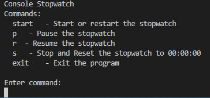
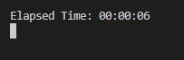
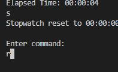
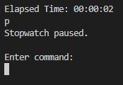

# Stopwatch
- Simple console stopwatch for college assignment.
- execute `dotnet run` to run the app

## Start
- execute `start` while the app is running to start the stopwatch

## Reset
- execute `s` while the app is running to reset the stopwatch

## Resume
- execute `r` while the app is running to resume the stopwatch

## Pause
- execute `p` while the app is running to pause the stopwatch  

